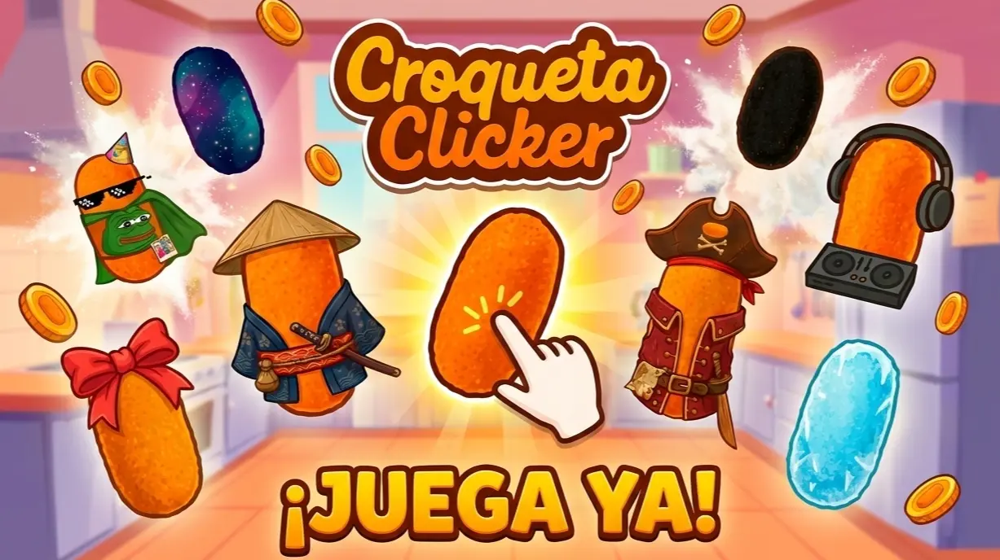

# Croqueta Clicker




**Croqueta Clicker** es un juego incremental inspirado en Cookie Clicker, desarrollado con Angular 21 y TypeScript.

¡Haz click en croquetas, desbloquea mejoras, compra productores automáticos y personaliza tu experiencia con skins exclusivas!

Visita **[croquetaclicker.whiteroot.studio](https://croquetaclicker.whiteroot.studio)** para jugarlo ya :)

Descarga el juego en Google Play:
**[https://play.google.com/store/apps/details?id=com.whiterootstudios.croquetaclicker](https://play.google.com/store/apps/details?id=com.whiterootstudios.croquetaclicker)**

> _Juego desarrollado como proyecto de la asignatura "Desarrollo de Interfaces"._

---

## Características principales

### Sistema de juego completo

- **Sistema de clicks**: Gana croquetas haciendo click (con efectos visuales y partículas)
- **Productores automáticos**: 15 tipos de productores que generan croquetas por segundo (early, mid, late y endgame)
- **Mejoras (Upgrades)**: 33 mejoras, diseñadas para mantener los clicks competitivos frente a los productores
- **Sistema de niveles**: Gana experiencia y sube de nivel desbloqueando contenido
- **Logros (Achievements)**: 30+ logros por desbloquear con diferentes categorías
- **Croqueta dorada**: Evento especial aleatorio con bonificación x2
- **Skins personalizables**: 33 skins desbloqueables para personalizar tu croqueta (comunes, raras, épicas y legendarias)
- **Música y efectos de sonido**: Audio dinámico que mejora la experiencia de juego
- **Opciones de configuración**: Ajustes de audio, gráficos y rendimiento
- **Estadísticas detalladas**: Panel con estadísticas de juego y progreso
- **Multilenguaje**: Soporte para español e inglés
- **Modo offline**: Juega sin conexión y sincroniza al volver online
- **Tabla de clasificación**: Compite con otros jugadores por el mejor puntaje
- **Eventos especiales**: Eventos temporales con bonificaciones únicas

### Características técnicas

- **Guardado automático y export/import**: Autoguardado cada minuto, guardado antes de unload, persistencia en localStorage y export/import cifrado (AES) a través de `OptionsService` y `AutosaveService`
- **Sincronización online (leaderboard)**: `SupabaseService` (sesiones anónimas, leaderboard y cola offline)
- **Persistencia y fallback**: `navigator.storage.persist` (intentamos solicitar persistencia) y gestión de fallbacks para navegadores en modo privado
- **PWA**: Instalación como aplicación web progresiva
- **TWA y Android**: soporte para Trusted Web Activity para publicar la experiencia como app Android
- **Arquitectura modular**: componentes UI reutilizables + páginas
- **Optimización de rutas**: RouteReuseStrategy personalizado
- **Gestión de números grandes**: Integración con break_infinity.js para números enormes
- **Interfaz responsiva**: Diseño adaptado para moviles y ordenadores
- **Audio dinámico**: Música y efectos de sonido
- **Efectos visuales**: Partículas, animaciones y efectos
- **Testing**: Tests unitarios con Karma y Jasmine

---

## Arquitectura del proyecto

### Patrón de diseño

El proyecto sigue una **arquitectura modular basada en componentes standalone** de Angular 21:

```
┌───────────────────────────────────────────┐
│            App (Root)                     │
│  - Control de splash screen               │
│  - Inicialización de servicios globales   │
│  - Gestión de audio por nivel             │
└────────────────┬──────────────────────────┘
                 │
    ┌────────────┴───────────┐
    │                        │
┌───▼────────┐    ┌──────────▼────────┐
│  Clicker   │    │   Router Outlet   │
│ Container  │    │   (Menu Pages)    │
│ - Stats    │    │   - News          │
│ - Clicker  │    │   - Upgrades      │
│ - Counter  │    │   - Achievements  │
│ - Particles│    │   - Options       │
│ - Floating │    │   - Skins         │
└────────────┘    └───────────────────┘
```

### Layout y comportamiento (Home / Clicker)

La aplicación usa un layout persistente con el componente principal de juego (`app-clicker`) visible en la parte izquierda del diseño (o en toda la pantalla en móviles), mientras que el área de contenido (`router-outlet`) en la derecha muestra las páginas: `Upgrades`, `Achievements`, `Skins`, `Options`, etc. El `app-clicker` actúa como el componente Home y las páginas del menú son los componentes adicionales accesibles mediante `app-navbar`.

### Flujo de datos

1. **Servicios singleton** gestionan el estado global (ej. `PointsService`, `PlayerStats`, `AchievementsService`, `SkinsService`)
2. **Signals, Effects y RxJS Observables** para reactividad y eventos asíncronos (la UI usa signals para minimizar renderizados innecesarios)
3. **OptionsService** centraliza el acceso a `localStorage` y actúa como punto único de persistencia (con prefijo, cifrado para export/import y comprobación de disponibilidad/persistencia)
4. **AutosaveService** guarda periódicamente el estado y maneja export/import; también guarda al cerrar o cambiar de visibilidad con `beforeunload`, `pagehide` y `visibilitychange`
5. **SupabaseService** gestiona la sesión anónima, leaderboard y sincronización cuando el usuario está online
6. **Datos de balance y contenido** (productores, upgrades, skins, logros) se encuentran en `src/app/data/*` y están desacoplados de la lógica y la UI

### Más información

Puedes consultar una documentación más detallada del proyecto [aquí](DOCS.md).

---

## Documentación y tests 🧩

- **Documentación de diseño y arquitectura:** `DOCS.md` contiene detalles sobre el diseño del sistema, los servicios, los datos del juego y el flujo de interacción.
- **Tests unitarios y guía de tests:** `UNITTESTS.md` resume las pruebas unitarias más importantes del repositorio. Mira este archivo para entender los objetivos de cada test y los casos más críticos.

### ¿Qué puedes hacer clonando este repositorio?

1. **Puedes ver la PWA en navegador**: `pnpm install` + `ng serve` - http://localhost:4200
2. **Genera APK debug con Gradle**: `gradlew.bat assembleDebug` - `app/build/outputs/apk/debug/app-debug.apk`
3. **Prueba la app en móvil**: instala el APK debug generado

---

## Requisitos previos

- [Git](https://git-scm.com/) (opcional, para clonar el repositorio)

- [NVM](https://github.com/nvm-sh/nvm) (opcional, para gestionar versiones de Node.js)
- [Node.js](https://nodejs.org/) v20.19.0 o superior
- [PNPM](https://pnpm.io/) v10.20.0 (gestor de paquetes)
- [Angular CLI](https://github.com/angular/angular-cli) v21

- [Java JDK](https://adoptium.net/) v11 o superior (opcional, para generar APK)
- [Android SDK](https://developer.android.com/studio) (opcional, Gradle lo descarga si falta)

---

## Instalación y ejecución

### Para ejecutar la PWA (desarrollo web)

```bash
git clone https://github.com/impavloh/croqueta-clicker.git
cd croqueta-clicker

# Instalar Node.js 20.x (si no lo tienes)
nvm install 20.19.0
nvm use 20.19.0

# Instalar PNPM globalmente  (si no lo tienes)
npm install -g pnpm

# Instalar dependencias
pnpm install

# Iniciar servidor de desarrollo
ng serve
```

La aplicación estará disponible en **[http://localhost:4200/](http://localhost:4200/)**

El servidor recargará automáticamente al detectar cambios en los archivos.

### Para generar APK Android (Gradle directo)

> Este repositorio incluye también el proyecto Android ya generado con **Bubblewrap**.  
> Bubblewrap solo lo utilizamos los desarrolladores para generar la APK firmada y publicarla en Google Play.
> **No necesitas Bubblewrap** para compilar un APK _debug_.

Si tienes **Java + Android SDK** instalados, puedes generar un APK de depuración con:

```bash
# Windows
gradlew.bat assembleDebug

# Linux / macOS
./gradlew assembleDebug
```

> **Nota**: El APK generado es de depuración y no está firmado para producción.

El APK quedará en: `app/build/outputs/apk/debug/app-debug.apk`

### APK para pruebas

Si quieres probar el juego descargado sin compilarlo, descarga el APK debug desde: **[apk/CroquetaClicker-debug.apk](apk/CroquetaClicker-debug.apk)**

> **Nota**: Para instalarlo necesitas habilitar "Instalar apps de fuentes desconocidas" en Android. Este APK no está firmado.

---

## Scripts disponibles (Angular CLI)

| Comando                                | Descripción                                            |
| -------------------------------------- | ------------------------------------------------------ |
| `ng serve`                             | Inicia servidor de desarrollo en http://localhost:4200 |
| `ng build`                             | Compila el proyecto para producción en `/dist`         |
| `ng build --configuration development` | Compila en modo desarrollo (con source maps)           |
| `ng test`                              | Ejecuta tests unitarios con Karma + Jasmine            |
| `ng serve --open`                      | Inicia servidor y abre navegador automáticamente       |

---

## Publicación en Google Play (Trusted Web Activity)

Este proyecto está en Google Play como una **TWA (Trusted Web Activity)**: un contenedor Android mínimo que abre la PWA a pantalla completa dentro de Chrome. El wrapper **no se incluye completamente** en este repositorio para mantenerlo limpio y proteger las claves de firma.

Descarga el juego en Google Play:
**[https://play.google.com/store/apps/details?id=com.whiterootstudios.croquetaclicker](https://play.google.com/store/apps/details?id=com.whiterootstudios.croquetaclicker)**

---

## Contribuciones y Pull Requests

¡Las sugerencias de la comunidad son bienvenidas! Para colaborar mantenemos estas normas:

- **Licencia:** Al enviar una Pull Request, tu código se integra bajo la misma licencia CC BY-NC-SA 4.0.
- **Propiedad comercial:** La aceptación de tu contribución **no te otorga derechos sobre el proyecto ni su monetización**, que permanecen con los autores.
- **Reconocimiento:** Si tu PR se acepta, aparecerás en la lista de colaboradores y en la sección de créditos del juego.

Gracias por aportar tu tiempo y talento al proyecto :)

## Autores

- **[Pavloh](https://github.com/ImPavloh)**
- **[Roberto Cichón](https://github.com/RobertoCichon)**
- **[Víctor RG](https://github.com/VictorRG15)**

## Política de privacidad

Privacidad: Este juego utiliza almacenamiento local y no recopila datos personales externos. Consulta nuestra **[Política de Privacidad](https://croquetaclicker.whiteroot.studio/privacidad)**.

## Licencia

El código y los assets propios de Croqueta Clicker se distribuyen bajo la licencia  
**[Creative Commons Attribution-NonCommercial-ShareAlike 4.0 International (CC BY-NC-SA 4.0)](LICENSE)**.

Esto implica:

- Puedes ver, modificar y redistribuir el proyecto.
- No puedes usarlo con fines comerciales.
- Debes atribuir a los autores originales.
- Cualquier modificación debe mantenerse bajo la misma licencia.

## Nota sobre assets

Algunos assets actuales (arte, imágenes o iconos), a pesar de haber sido editados, han sido generados mediante herramientas de inteligencia artificial y según la legislación aplicable, pueden no estar completamente protegidos por derechos de autor.

Dentro de este repositorio, dichos assets se distribuyen bajo los mismos términos (CC BY-NC-SA 4.0) en la medida en que la ley lo permita.

En el futuro, estos assets serán reemplazados por contenido original creado por artistas, que sí quedará plenamente protegido por esta licencia.
El uso de IA en esta fase inicial se debió únicamente a limitaciones de tiempo y presupuesto, dado que el proyecto fue desarrollado para una asignatura.

Apoyamos el trabajo de los artistas y creadores de contenido. Preferimos utilizar arte humano siempre que sea posible y por ello, buscamos reemplazar progresivamente cualquier asset generado por IA.

Si eres un artista interesado en colaborar con nosotros para crear nuevos assets originales, no dudes en contactarnos.

## Derechos comerciales

Los derechos comerciales de Croqueta Clicker pertenecen exclusivamente a  
**ImPavloh, RobertoCichon y VictorRG15**.  
Cualquier uso comercial requiere permiso explícito de los autores.
